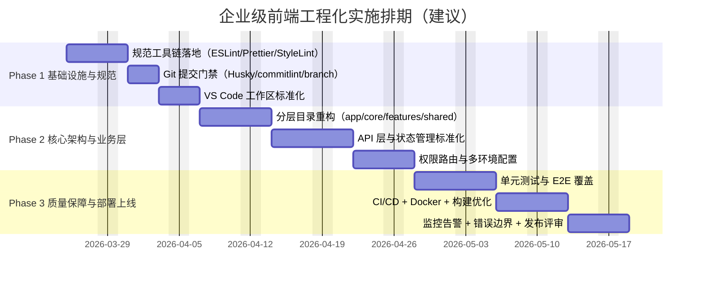

# 企业级前端架构路线图（Vue 3 + TypeScript + Vite）

> 适用项目：`nest-server-client`（当前基线：Vue 3 + TS + Vite，基础模板项目）  
> 目标：在不推翻现有工程的前提下，分三阶段落地企业级前端工程化能力。

## 目录

- [目标与边界](#目标与边界)
- [阶段总览](#阶段总览)
- [当前状态表（进行中未开始已完成）](#当前状态表进行中未开始已完成)
- [Phase 1 基础设施与规范](#phase-1-基础设施与规范)
- [Phase 2 核心架构与业务层](#phase-2-核心架构与业务层)
- [Phase 3 质量保障与部署上线](#phase-3-质量保障与部署上线)
- [全局风险矩阵与缓解计划](#全局风险矩阵与缓解计划)
- [里程碑甘特图](#里程碑甘特图)
- [验收与发布门禁](#验收与发布门禁)
- [临时 TODO 记录](#临时-todo-记录)

## 目标与边界

- 覆盖开发规范、模块化架构、质量保障、构建部署、安全可观测性、技术文档全链路。
- 采用 `- [ ]` 任务清单，可直接复制到评审纪要/Jira/TAPD。
- 工时采用“人日”，已包含联调与评审时间。
- 责任方默认角色：前端（FE）、运维（OPS）、架构（ARCH）；可按团队实际映射到具体人员。

## 阶段总览

- **Phase 1（2~3 周）**：基础工程规范、提交门禁、编辑器统一配置。
- **Phase 2（3~5 周）**：目录重构、API/状态管理/权限路由等核心架构落地。
- **Phase 3（3~4 周）**：测试体系、CI/CD、容器化、可观测性、上线门禁闭环。

## 当前状态表（进行中/未开始/已完成）

| 阶段          | 任务                                                                    | 状态   | 说明                                                       |
| ------------- | ----------------------------------------------------------------------- | ------ | ---------------------------------------------------------- |
| Phase 1 / 1.1 | 建立 ESLint + Prettier + StyleLint 统一规范                             | 已完成 | 已形成统一 lint/format 流程并可稳定执行                    |
| Phase 1 / 1.1 | 开启 TypeScript 严格模式补齐项（`noImplicitAny`、`strictNullChecks`）   | 已完成 | 严格模式已启用并纳入日常校验                               |
| Phase 1 / 1.2 | 落地 Husky + lint-staged + commit-msg + branch-naming 规范              | 已完成 | 提交门禁与分支规范已生效                                   |
| Phase 1 / 1.3 | 提供 `.vscode/settings.json` 模板与推荐插件清单                         | 已完成 | 工作区开发体验与格式化规则已统一                           |
| Phase 2 / 2.1 | 建立统一目录结构（`src/app`、`src/core`、`src/features`、`src/shared`） | 已完成 | 分层目录与别名已落地                                       |
| Phase 2 / 2.1 | 建立原子/业务/布局组件分层规范                                          | 已完成 | 已落地 atoms/layouts/业务组件分层，Home 示例已完成拆分     |
| Phase 2 / 2.2 | 建立 composables 约定与副作用治理                                       | 已完成 | 已沉淀 3 个 composables 并在 Workspace/Admin 跨页面复用    |
| Phase 2 / 2.3 | 搭建 axios 实例、拦截器与错误码处理中台                                 | 已完成 | 统一 HTTP 客户端、鉴权与错误处理已上线                     |
| Phase 2 / 2.3 | 建立 API 类型自动推导与 Mock 方案                                       | 已完成 | 已落地 endpoint 类型推导与 MSW，支持并行联调               |
| Phase 2 / 2.4 | 落地 Pinia 模块化、持久化与 SSR 兼容约束                                | 已完成 | 会话状态管理与持久化策略已接入                             |
| Phase 2 / 2.4 | 完成多环境变量体系与 Vite 配置（base/dev/test/prod）                    | 已完成 | `.env*` 与运行时环境读取已接通                             |
| Phase 2 / 2.5 | 实施 RBAC 权限路由、动态菜单与路由守卫                                  | 已完成 | 动态路由、角色权限校验和 403 拦截已实现                    |
| Phase 3 / 3.1 | 建立 Vitest + Vue Test Utils 单元测试体系（覆盖率≥80%）                 | 已完成 | Vitest + Vue Test Utils + 覆盖率门禁已落地，当前覆盖率达标 |
| Phase 3 / 3.1 | 建立 Cypress E2E，覆盖核心流程 10 条用例                                | 已完成 | Cypress 骨架与 10 条核心流程用例已落地并通过本地回归       |
| Phase 3 / 3.1 | 建立 MR 模板与 Code Review 清单                                         | 已完成 | PR 模板与 20 条评审清单已落地                              |
| Phase 3 / 3.2 | 建立多环境 CI/CD（dev/test/stage/prod）                                 | 未开始 | 流水线编排与分支发布策略未落地                             |
| Phase 3 / 3.2 | 落地 Dockerfile 多阶段构建与安全基线                                    | 未开始 | 容器化构建与镜像安全扫描未接入                             |
| Phase 3 / 3.2 | 执行 Vite 分包策略与性能预算治理                                        | 未开始 | manualChunks 与性能预算未实施                              |
| Phase 3 / 3.3 | 集成 Sentry + 自定义埋点 + Web-Vitals 上报                              | 未开始 | 可观测性 SDK 与告警策略未接入                              |
| Phase 3 / 3.3 | 建立错误边界与降级页机制                                                | 未开始 | 统一错误边界与降级页尚未建设                               |
| Phase 3 / 3.4 | 建立 JSDoc 规范、Storybook、README 与 ADR 目录                          | 未开始 | 文档体系与 ADR 机制未完整建立                              |

---

## Phase 1 基础设施与规范

### 1.1 代码规范与格式化基线

- [x] 建立 ESLint + Prettier + StyleLint 统一规范
  - **实施内容**：技术选型为 `eslint@latest` + `@typescript-eslint` + `eslint-plugin-vue` + `prettier` + `stylelint` + `stylelint-config-standard`；新增 `.eslintrc.cjs`、`.prettierrc.cjs`、`.stylelintrc.cjs`；在 `package.json` 增加 `lint`、`lint:fix`、`format`、`stylelint` 脚本；代码示例位置：`src/components/HelloWorld.vue`、`src/style.css`；验收标准：本地与 CI 执行 lint 全通过，PR 无格式化噪音提交。
  - **优先级**：P0
  - **责任方**：前端（FE-Owner）
  - **预估工时**：2.0 人日
  - **交付物**：`.eslintrc.cjs`、`.prettierrc.cjs`、`.stylelintrc.cjs`、`package.json` scripts 更新、规范说明文档
  - **风险与缓解**：旧代码一次性修复量大；采用“先自动修复后人工 review”，分模块提交。

- [x] 开启 TypeScript 严格模式补齐项（`noImplicitAny`、`strictNullChecks`）
  - **实施内容**：在 `tsconfig.app.json` 与 `tsconfig.node.json` 明确配置 `strict: true`、`noImplicitAny: true`、`strictNullChecks: true`；示例位置：`tsconfig.app.json`、`tsconfig.node.json`；验收标准：`vue-tsc -b` 零错误，新增代码不允许 `any` 漏出。
  - **优先级**：P0
  - **责任方**：前端（FE-Owner）+ 架构（ARCH-Reviewer）
  - **预估工时**：1.5 人日
  - **交付物**：TS 配置文件、类型问题修复清单、评审记录
  - **风险与缓解**：历史隐式 `any` 阻塞；设置迁移白名单并在两周内清零。

### 1.2 Git 提交流程门禁

- [x] 落地 Husky + lint-staged + commit-msg + branch-naming 规范
  - **实施内容**：引入 `husky`、`lint-staged`、`@commitlint/cli`、`@commitlint/config-conventional`；配置 `.husky/pre-commit`、`.husky/commit-msg`；`commitlint.config.cjs` 限定提交信息；增加分支命名规则 `feature/*`、`fix/*`、`hotfix/*`、`chore/*` 并在 CI 校验；示例位置：`.husky/*`、`.github/workflows/*` 或 `.gitlab-ci.yml`；验收标准：不合规 commit 与分支在本地/CI 均被拦截。
  - **优先级**：P0
  - **责任方**：前端（FE-Owner）+ 运维（OPS）
  - **预估工时**：2.0 人日
  - **交付物**：Husky 钩子、`lint-staged.config.mjs`、`commitlint.config.cjs`、[分支规范文档](./分支规范文档.md)
  - **风险与缓解**：团队习惯不一致；首周灰度（告警不阻断），次周切强校验。

### 1.3 VS Code 工作区标准化

- [x] 提供 `.vscode/settings.json` 模板与推荐插件清单
  - **实施内容**：在现有 `.vscode/extensions.json` 基础上补充 `dbaeumer.vscode-eslint`、`esbenp.prettier-vscode`、`stylelint.vscode-stylelint`、`Vue.volar`、`streetsidesoftware.code-spell-checker`；新增 `.vscode/settings.json` 配置保存即格式化、按语言默认 formatter、`eslint.validate`；示例位置：`.vscode/extensions.json`、`.vscode/settings.json`；验收标准：新成员拉库后 10 分钟内完成可用开发环境。
  - **优先级**：P1
  - **责任方**：前端（FE）
  - **预估工时**：1.0 人日
  - **交付物**：`.vscode/settings.json`、插件清单、入门说明
  - **风险与缓解**：不同 IDE 用户体验不一致；补充 CLI 校验保证编辑器无关一致性。

---

## Phase 2 核心架构与业务层

### 2.1 目录与模块分层重构

- [x] 建立统一目录结构（`src/app`、`src/core`、`src/features`、`src/shared`）
  - **实施内容**：将入口组装放入 `src/app`，基础能力（router/store/http）放入 `src/core`，业务域模块放入 `src/features`，通用组件/工具放入 `src/shared`；示例位置：`src/main.ts` 改为引用 `src/app/bootstrap.ts`；验收标准：新增需求必须落在分层目录，禁止跨层反向依赖。
  - **优先级**：P0
  - **责任方**：架构（ARCH-Owner）+ 前端（FE）
  - **预估工时**：3.0 人日
  - **交付物**：目录迁移 PR、分层依赖规则文档、路径别名配置
  - **风险与缓解**：重构冲突多；采用“小步迁移 + 每层一 PR + 自动化回归”。

- [x] 建立原子/业务/布局组件分层规范
  - **实施内容**：定义 `src/shared/components/atoms|molecules|organisms` 与 `src/app/layouts`；业务组件放 `src/features/*/components`；示例位置：现有 `HelloWorld.vue` 拆分为 `atoms/CounterButton.vue` 与页面容器；验收标准：组件目录结构可追溯，通用组件复用率持续提升。
  - **优先级**：P1
  - **责任方**：前端（FE）
  - **预估工时**：2.5 人日
  - **交付物**：组件分层规范、示例组件、重构记录
  - **风险与缓解**：过度抽象；规则要求“复用两次以上再抽象”。

### 2.2 Composition API 复用模式

- [x] 建立 composables 约定与副作用治理
  - **实施内容**：在 `src/shared/composables` 建立命名规则（`useXxx`）、参数与返回值类型模板、请求生命周期封装（loading/error/data）；已落地 `useAsyncState.ts`、`usePaginationState.ts`、`useRoutePageQuery.ts` 并在 Admin/Workspace 页面复用；验收标准：跨页面复用逻辑至少沉淀 3 个 composables，单测通过。
  - **优先级**：P1
  - **责任方**：前端（FE）
  - **预估工时**：2.0 人日
  - **交付物**：composables 模板、使用示例、单元测试
  - **风险与缓解**：业务耦合进入通用层；代码评审中增加“可复用性”检查项。

### 2.3 API 层标准化（axios + 类型推导 + mock）

- [x] 搭建 axios 实例、拦截器与错误码处理中台
  - **实施内容**：技术选型 `axios` + `qs`（可选）；在 `src/core/http/client.ts` 建立实例，`request/response` 拦截器统一处理 401/403/500；引入指数退避重试策略（幂等请求）；示例位置：`src/core/http/interceptors.ts`；验收标准：所有业务请求必须走统一客户端，错误提示一致。
  - **优先级**：P0
  - **责任方**：前端（FE-Owner）+ 架构（ARCH）
  - **预估工时**：2.5 人日
  - **交付物**：HTTP 基础层代码、错误码映射表、联调报告
  - **风险与缓解**：后端错误码不统一；推动接口契约评审并提供兜底映射。

- [x] 建立 API 类型自动推导与 Mock 方案
  - **实施内容**：已在 `src/core/http/endpoint.ts` 落地 endpoint 声明与 `InferEndpointRequest/InferEndpointResponse` 类型推导，业务 API 统一基于 endpoint 封装；Mock 采用 `msw`，落地 `src/mocks/handlers.ts` + `src/mocks/browser.ts`，通过 `VITE_ENABLE_MOCK` 控制启停；验收标准：关键接口有类型约束与 mock 数据，前后端可并行开发。
  - **优先级**：P1
  - **责任方**：前端（FE）+ 架构（ARCH）
  - **预估工时**：3.0 人日
  - **交付物**：类型生成脚本、mock 配置、联调说明
  - **风险与缓解**：文档与真实接口漂移；在 CI 增加 schema diff 检查。

### 2.4 状态管理与多环境配置

- [x] 落地 Pinia 模块化、持久化与 SSR 兼容约束
  - **实施内容**：引入 `pinia`、`pinia-plugin-persistedstate`；按 `src/features/*/store` 模块化；约束 store 中不直接访问浏览器全局对象，预留 SSR 兼容；示例位置：`src/core/store/index.ts`、`src/features/auth/store/useAuthStore.ts`；验收标准：核心会话状态可恢复，刷新不丢失，SSR 兼容规则通过评审。
  - **优先级**：P0
  - **责任方**：前端（FE-Owner）
  - **预估工时**：2.5 人日
  - **交付物**：store 架构代码、持久化策略文档、验证记录
  - **风险与缓解**：敏感信息持久化泄露；仅持久化白名单字段并加密/脱敏。

- [x] 完成多环境变量体系与 Vite 配置（base/dev/test/prod）
  - **实施内容**：新增 `.env`、`.env.development`、`.env.test`、`.env.production`；统一变量前缀 `VITE_`；在 `vite.config.ts` 基于 `mode` 注入环境差异；示例位置：`vite.config.ts`、`src/core/config/env.ts`；验收标准：四套环境可独立构建与运行，关键地址（API、监控 DSN）可切换。
  - **优先级**：P0
  - **责任方**：前端（FE）+ 运维（OPS）
  - **预估工时**：1.5 人日
  - **交付物**：`.env*` 模板、环境变量文档、构建验证截图
  - **风险与缓解**：敏感配置误提交；将真实值放 CI Secret，仅保留 `.env.example`。

### 2.5 安全路由与权限模型

- [x] 实施 RBAC 权限路由、动态菜单与路由守卫
  - **实施内容**：在 `src/core/router` 增加路由元信息（`roles`、`permissions`）；登录后按权限动态注入路由；未授权跳转 403 页面；示例位置：`src/core/router/guards.ts`、`src/features/auth/permission.ts`；验收标准：低权限账号无法访问高权限页面，菜单按权限准确渲染。
  - **优先级**：P0
  - **责任方**：前端（FE）+ 架构（ARCH）+ 后端联调
  - **预估工时**：3.0 人日
  - **交付物**：权限路由代码、角色矩阵文档、联调用例
  - **风险与缓解**：前后端权限语义不一致；建立统一权限字典并版本化管理。

---

## Phase 3 质量保障与部署上线

### 3.1 测试体系与质量门禁

- [x] 建立 Vitest + Vue Test Utils 单元测试体系（覆盖率≥80%）
  - **实施内容**：引入 `vitest`、`@vue/test-utils`、`jsdom`、`@vitest/coverage-v8`；配置 `vitest.config.ts` 与覆盖率阈值（lines/statements/functions/branches ≥ 80%）；示例位置：`src/shared/composables/*.test.ts`、`src/features/*/*.test.ts`；验收标准：CI 单测通过且覆盖率达标。
  - **优先级**：P0
  - **责任方**：前端（FE-Owner）
  - **预估工时**：3.0 人日
  - **交付物**：测试配置、测试用例、覆盖率报告
  - **风险与缓解**：测试脆弱导致误报；优先覆盖稳定边界与纯逻辑模块。

- [x] 建立 Cypress E2E，覆盖核心流程 10 条用例
  - **实施内容**：引入 `cypress`，建立 `cypress/e2e`、`cypress/fixtures`；覆盖登录、鉴权跳转、关键业务提交、异常提示等 10 条路径；示例位置：`cypress/e2e/auth.cy.ts` 等；验收标准：主分支每日定时回归稳定通过，失败可复现。
  - **当前进展**：已完成 `cypress.config.ts`、`cypress/support/e2e.ts`、`cypress/fixtures/roles.json`、`cypress/e2e/core-flow.cy.ts` 与 `package.json` 的 `e2e:open`/`e2e:run` 脚本，累计覆盖 10 条核心路径（登录、鉴权跳转、权限拒绝、登出拦截、分页 query 回填与刷新保持、Mock 异常提示）。
  - **优先级**：P1
  - **责任方**：前端（FE）+ QA（如有）
  - **预估工时**：4.0 人日
  - **交付物**：E2E 用例、测试数据、回归报告
  - **风险与缓解**：环境不稳定导致 flaky；引入测试专用账号与固定种子数据。

- [x] 建立 MR 模板与 Code Review 清单（性能/安全/可访问性 20 条）
  - **实施内容**：新增 `.github/pull_request_template.md` 或 `.gitlab/merge_request_templates/default.md`；评审清单覆盖性能（包体、渲染）、安全（XSS/鉴权）、可访问性（键盘可达、语义标签）共 20 条；验收标准：所有 MR 必须勾选检查项方可合并。
  - **当前进展**：已新增 `.github/pull_request_template.md`，内置验证记录与性能/安全/可访问性 20 条评审清单，可直接用于合并前自检与评审。
  - **优先级**：P1
  - **责任方**：架构（ARCH-Owner）+ 前端（FE）
  - **预估工时**：1.5 人日
  - **交付物**：MR 模板、Review 清单、评审培训记录
  - **风险与缓解**：清单流于形式；每周抽样复盘并纳入质量 KPI。

### 3.2 构建优化与 CI/CD

- [ ] 建立多环境 CI/CD（dev/test/stage/prod）
  - **实施内容**：GitHub Actions 或 GitLab CI 二选一；流水线分为 install→lint→typecheck→test→build→deploy；按分支触发不同环境；示例位置：`.github/workflows/pipeline.yml` 或 `.gitlab-ci.yml`；验收标准：四环境可自动构建部署，失败可回滚。
  - **优先级**：P0
  - **责任方**：运维（OPS-Owner）+ 前端（FE）
  - **预估工时**：3.0 人日
  - **交付物**：CI/CD 配置、部署脚本、回滚手册
  - **风险与缓解**：流水线耗时过长；启用依赖缓存与并行 job。

- [ ] 落地 Dockerfile 多阶段构建与安全基线
  - **实施内容**：使用 `node:alpine` 构建 + `nginx:alpine` 运行，多阶段复制产物；非 root 用户、最小镜像层、缓存优化（先拷贝 lockfile）；示例位置：`Dockerfile`、`nginx.conf`；验收标准：镜像可在目标环境启动，安全扫描无高危漏洞。
  - **优先级**：P0
  - **责任方**：运维（OPS）+ 前端（FE）
  - **预估工时**：2.0 人日
  - **交付物**：Dockerfile、nginx 配置、镜像扫描报告
  - **风险与缓解**：基础镜像漏洞；固定版本并设置周期性重建。

- [ ] 执行 Vite 分包策略与性能预算治理
  - **实施内容**：在 `vite.config.ts` 配置 `build.rollupOptions.manualChunks`（vendor/polyfill）；业务路由动态 `import()`；结合 `vite-bundle-visualizer` 分析包体；设定预算：首屏 JS ≤ 300KB、LCP ≤ 2.5s；验收标准：预算在 stage 环境实测达标。
  - **优先级**：P1
  - **责任方**：前端（FE-Owner）+ 架构（ARCH）
  - **预估工时**：2.5 人日
  - **交付物**：Vite 配置、性能报告、优化记录
  - **风险与缓解**：第三方包膨胀；建立依赖准入与替代评估机制。

### 3.3 可观测性与故障恢复

- [ ] 集成 Sentry + 自定义埋点 + Web-Vitals 上报
  - **实施内容**：接入 `@sentry/vue`；在 `src/core/observability` 统一初始化；上报 `LCP/FID/CLS` 与关键业务事件；示例位置：`src/main.ts`、`src/core/observability/index.ts`；验收标准：test/stage 可看到错误、性能与业务埋点数据。
  - **优先级**：P1
  - **责任方**：前端（FE）+ 运维（OPS）
  - **预估工时**：2.0 人日
  - **交付物**：监控初始化代码、告警规则、仪表盘截图
  - **风险与缓解**：噪音告警过多；建立采样率与告警分级策略。

- [ ] 建立错误边界与降级页机制
  - **实施内容**：在 `src/app` 增加 ErrorBoundary 组件与全局错误兜底页；请求失败、渲染异常提供重试与反馈入口；示例位置：`src/app/ErrorBoundary.vue`、`src/app/views/ErrorFallback.vue`；验收标准：故障场景下页面可控降级，无白屏不可恢复状态。
  - **优先级**：P1
  - **责任方**：前端（FE）
  - **预估工时**：1.5 人日
  - **交付物**：错误边界代码、降级页设计稿、演练记录
  - **风险与缓解**：边界覆盖不完整；增加故障演练脚本与回归用例。

### 3.4 技术文档体系

- [ ] 建立 JSDoc 规范、Storybook、README 与 ADR 目录
  - **实施内容**：统一 JSDoc 模板（用途/参数/返回/异常）；引入 `storybook` 输出组件文档（Props/Event/Slot）；完善 README（运行/调试/部署/FAQ）；新增 `docs/adr`（如 `0001-目录分层决策.md`）；示例位置：`src/shared/components/*`、`docs/adr/*`；验收标准：核心组件均有文档，关键架构决策可追溯。
  - **优先级**：P2
  - **责任方**：前端（FE）+ 架构（ARCH）
  - **预估工时**：3.0 人日
  - **交付物**：Storybook 站点、ADR 文档、README 完整版、JSDoc 规范
  - **风险与缓解**：文档滞后；将文档更新纳入 MR 必填项与发布门禁。

---

## 全局风险矩阵与缓解计划

| 风险类别       | 典型风险                       | 触发信号                 | 影响     | 缓解措施                           | 责任方       |
| -------------- | ------------------------------ | ------------------------ | -------- | ---------------------------------- | ------------ |
| 技术债         | 早期模板代码未分层，重构成本高 | PR 频繁跨层改动          | 交付延期 | 分层迁移计划、依赖边界 lint 规则   | ARCH + FE    |
| 第三方库兼容性 | 插件与 Vite/TS 版本冲突        | 构建失败、类型报错激增   | 阻塞上线 | 锁定版本、灰度升级、兼容性矩阵     | FE           |
| 人员单点       | 关键模块只有 1 人熟悉          | 请假/离职时无人接手      | 风险高   | 双人结对、模块轮值、ADR 沉淀       | FE Lead      |
| 联调不确定性   | 后端接口变更无通知             | E2E 用例集中失败         | 返工     | OpenAPI 契约评审、schema diff CI   | FE + Backend |
| 发布稳定性     | 多环境配置漂移                 | 同代码不同环境行为不一致 | 线上故障 | 环境变量模板化、配置审计、回滚预案 | OPS          |

## 里程碑甘特图

## 验收与发布门禁

- [ ] **P0 全量完成**：P0 任务未完成不得进入生产发布窗口。
- [ ] **质量门禁通过**：`lint`、`typecheck`、单测覆盖率阈值、核心 E2E 全通过。
- [ ] **性能门禁通过**：首屏 JS ≤ 300KB、LCP ≤ 2.5s（stage 实测）。
- [ ] **安全门禁通过**：鉴权路由、401/403/500 统一处理、镜像扫描无高危。
- [ ] **文档门禁通过**：README、ADR、MR 模板、Review 清单同步更新。

## 临时 TODO 记录

- [ ] 分页 query key 进行页面级命名隔离（如 `workspacePage/workspacePageSize`、`adminPage/adminPageSize`），避免后续同路由多分页模块参数冲突。
